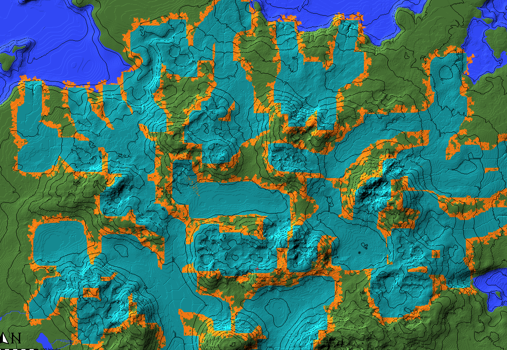
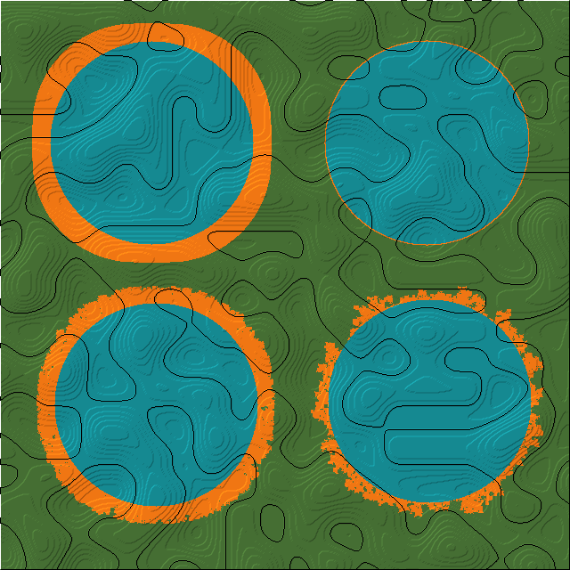
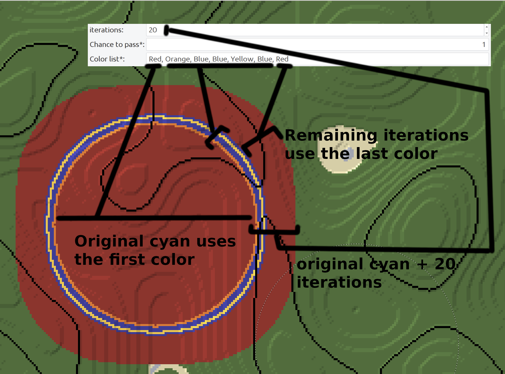

# Expand Layer

expand the cyan annotations layer by x amount of blocks in all directions
choose the chance for each new layer to stop generating

The script will generate layer by layer, like an onion, inside out

downloads: https://github.com/IR0NSIGHT/ExpandLayer/releases  
github: https://github.com/IR0NSIGHT/ExpandLayer

1. Top left: 20 iterations, 1 chance
2. Top right: 1 iterations, 1 chance
3. Bottom left: 20 iterations, 0.7 chance
4. Bottom right: 20 iterations, 0.5 chance

# Instructions

### IMPORTANT: SAVE YOUR WORLD BEFORE RUNNING! THIS SCRIPT CAN CRASH WORLDPAINTER AND YOU LOOSE ALL UNSAVED CONTENT!

1. download the newest release as a zip file puddler.js file
2. unpack the zip folder somewhere
3. mark all the spots of the original shape with the CYAN annotation layer.
4. in WorldPainter, on the top toolbar, center-right, open "run script" and select ExpandLayer_v?.?.?.js from the folder where you
   unpacked the zip file
5. Select your parameters:
- Chance: every block will have x chance to be skipped. 
- Iterations: the script will find x layers of blocks surrounding the cyan annotations.
- Colors: "Red, Green, Green, Green, Blue" will make the zero-layer (cyan) be red, then 3 green layers and all the rest be blue. Use "None" like a color to paint no annotation.
6. Run the script. Colored annotation will generate around the cyan annotations.

## Advanced Color Banding

# Known issues
The next layer is selected based on neighbouring: if a block touches the original layer, it will become the next layer
This causes some shape-artefacts on the diagonal direction, causing circles to become slightly distorted.
Solution: use distance based pathfinding, dijkstras algorithm. Not worth it for this application.
